# Procesverslag
Markdown is een simpele manier om HTML te schrijven.  
Markdown cheat cheet: [Hulp bij het schrijven van Markdown](https://github.com/adam-p/markdown-here/wiki/Markdown-Cheatsheet).

Nb. De standaardstructuur en de spartaanse opmaak van de README.md zijn helemaal prima. Het gaat om de inhoud van je procesverslag. Besteedt de tijd voor pracht en praal aan je website.

Nb. Door *open* toe te voegen aan een *details* element kun je deze standaard open zetten. Fijn om dat steeds voor de relevante stuk(ken) te doen.

## Jij

  
uitwerken voor kick-off werkgroep

  ### Auteur:
  Kanokphon Sophaphon

  #### Je startniveau:
  Rood/blauw

  #### Je focus:
  Surface plane
 

## Je website

  
uitwerken voor kick-off werkgroep

  ### Je opdracht:
  Link naar YesStyle: https://www.yesstyle.com/en/home.html

  #### Screenshot(s) van de eerste pagina (small screen): 
  
Naam van de pagina: Home

  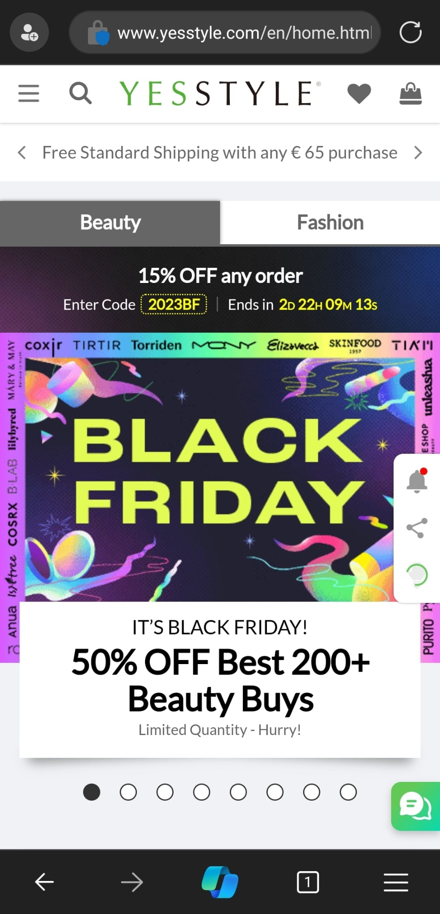 

  #### Screenshot(s) van de tweede pagina (small screen):
  
Naam van de pagina: Blog

  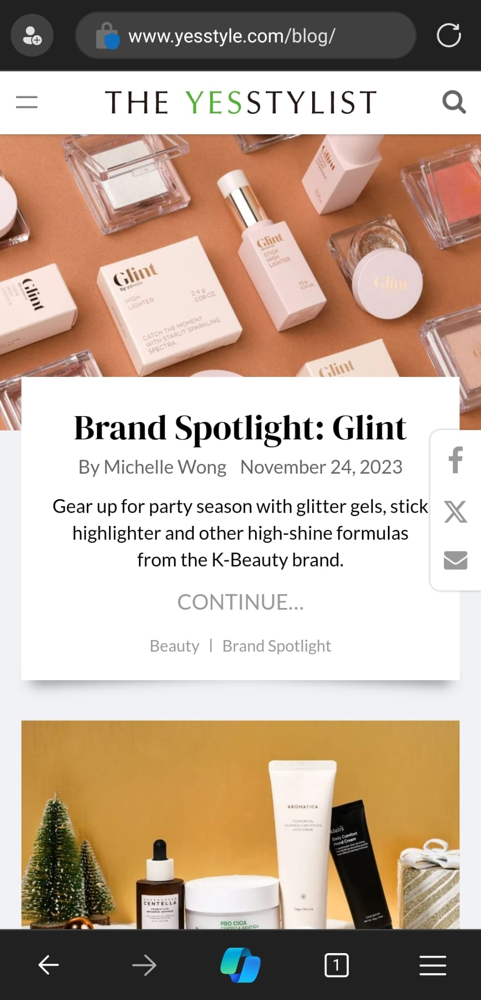 
 

## Toegankelijkheidstest 1/2 (week 1)

  
uitwerken na test in 2e werkgroep

  ### Bevindingen
  Lijst met je bevindingen die in de test naar voren kwamen:
  
  Verteller:
  1. Sweatshirts & Hoodies geen echt problemen gevonden
  2. Persona Investigator - De verteller pakt de socials aan de zijkant niet
  3. Persona Investigator - Pijtjes om te scrollen tussen de kledingstuken pakt de verteller niet
  4. Persona Investigator - Nav. pakt de verteller raar nadat het gescrold is

  WCAG:
  1. Content - Buttons en etc. kan interessanter
  2. Global code - HTML kan iets beter (minder div bv)
  3. Keyboard - Volgorde kan misschien beter van boven naar beneden
  4. Mobile and touch - Er kan iets meer ruimte tussen de icons
  5. 

## Breakdownschets (week 1)

  
uitwerken na afloop 3e werkgroep

  ### de hele pagina: 
  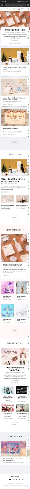

  ### dynamisch deel (bijv menu): 
  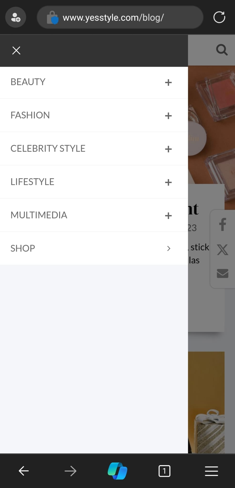

  ### wellicht nog een dynamisch deel (bijv filter): 
  

## Voortgang 1 (week 2)

  
uitwerken voor 1e voortgang

  ### Stand van zaken
  hier dit ging goed & dit was lastig (neem ook screenshots op van delen van je website en code)

Ik loop super achter door verschillende emementen binnen en vooral buiten dit vak. Eén van de reden is dat ik op het laaste moment van schemen verandert ben waardoor onder andere de 'breakdownschets' nog niet af is en ook de code. Wat ik latsig vond is om de html code meteen in klein schem te schrijven.

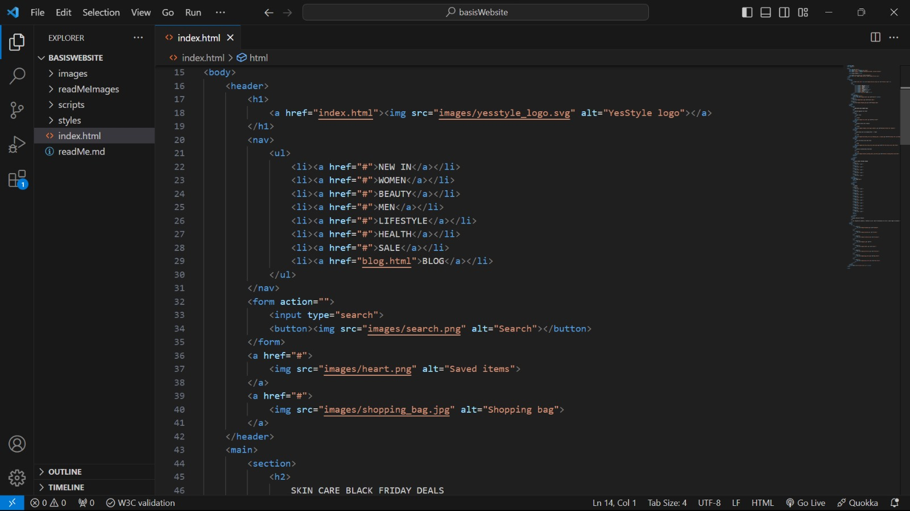
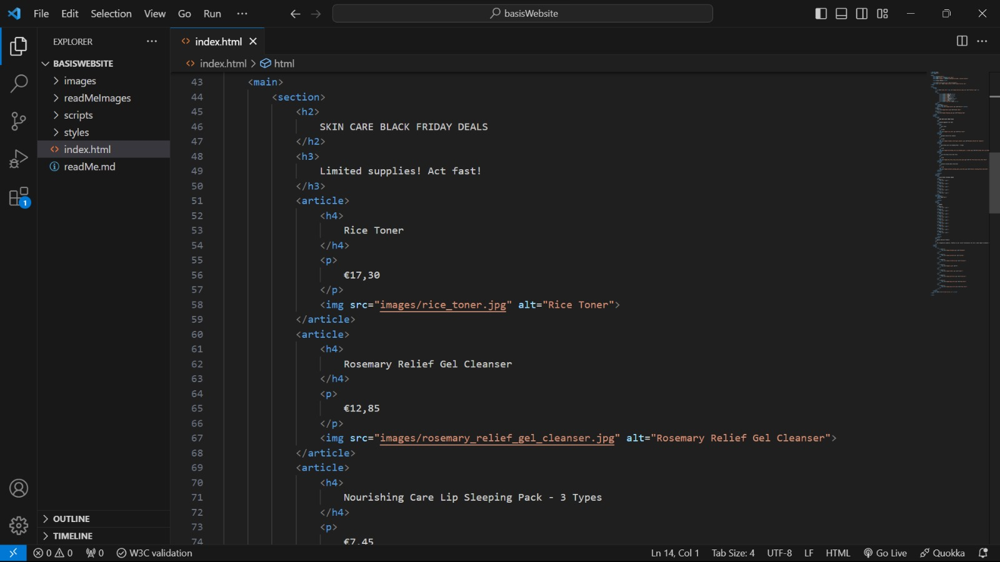
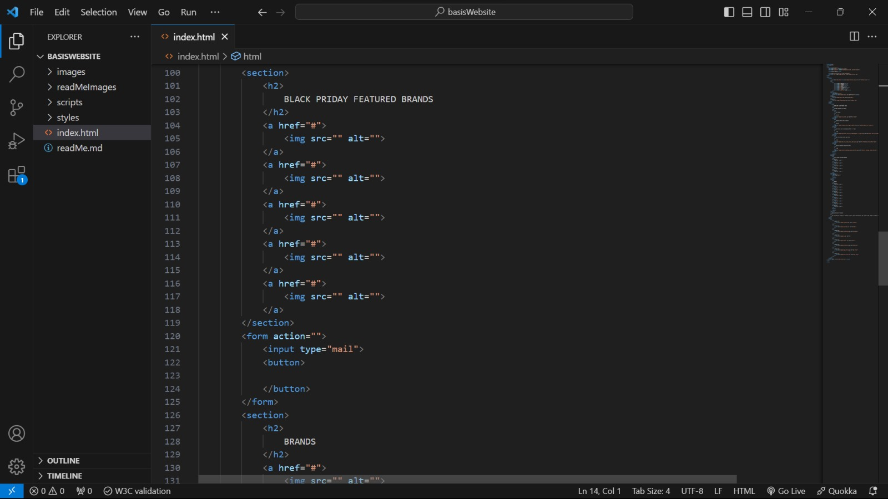
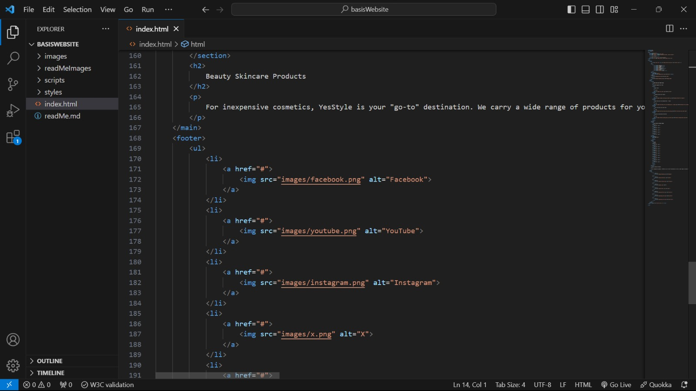

  ### Agenda voor meeting
  Silke - Breakdownschets 

  
  Bink - Wat kun je doen ipv een div 

  
  Zoë - Detail, html en css vragen 

  
  Mees - Hoe werkt @font-face

  
  Kanokphon - GIF kopiëren en stilzetten 

  
  ### Verslag van meeting
  hier na afloop snel de uitkomsten van de meeting vastleggen

  - @font-face -> wis cach -> ga naar fonts -> zet boven in css 
  - ipv div ul en il gebruiken voor product scroll
  - hooftletters in css
  - maak van alles sections
  - button en/of a in sections
  - in form moet ook label en plaseholder
  - gif stoppen via picture

## Voortgang 2 (week 3)

  
uitwerken voor 2e voortgang

  ### Stand van zaken
  hier dit ging goed & dit was lastig (neem ook screenshots op van delen van je website en code)
  Root in de css verwerken ging goed en zonder echte problemen. Wat lastig was de header tel versie en de verschillende magin van de verschillende onderdelen.
  
  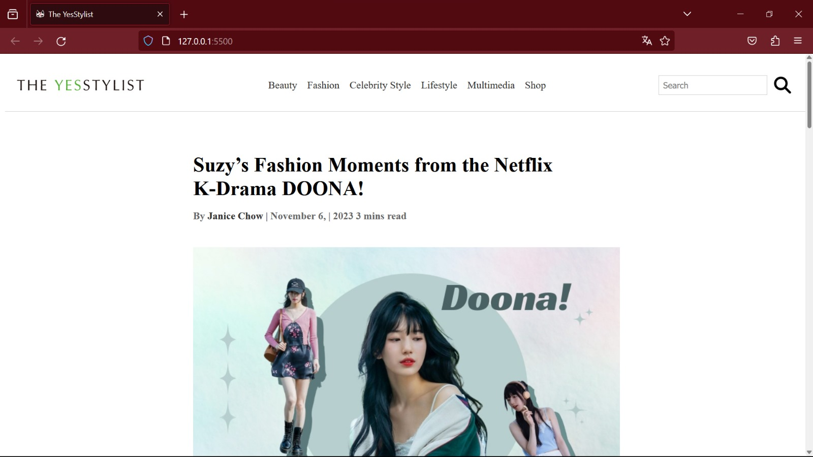
  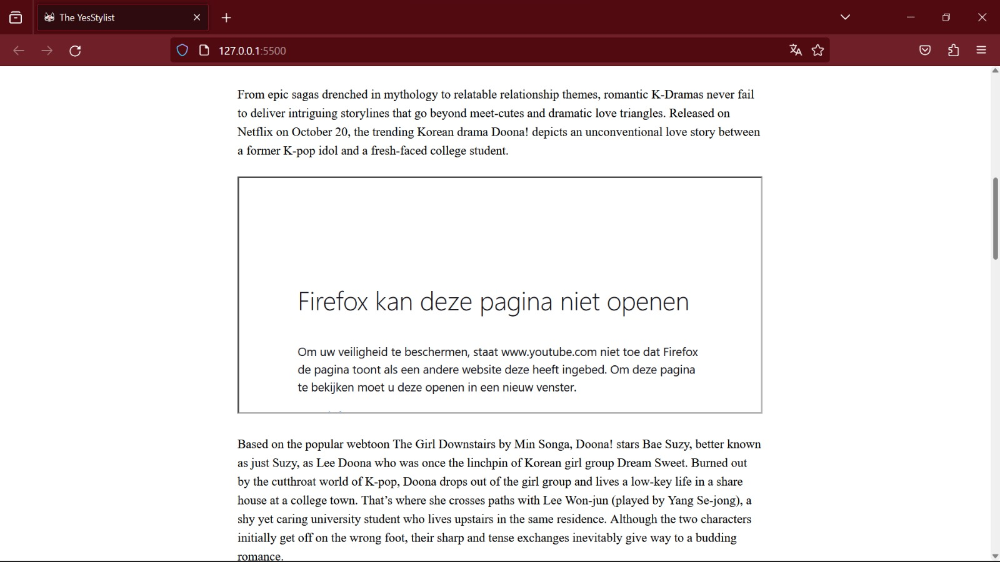
  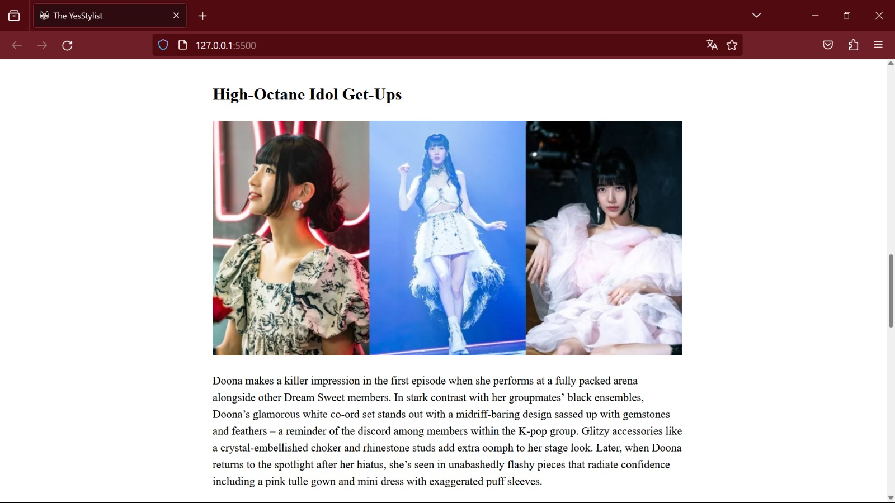
  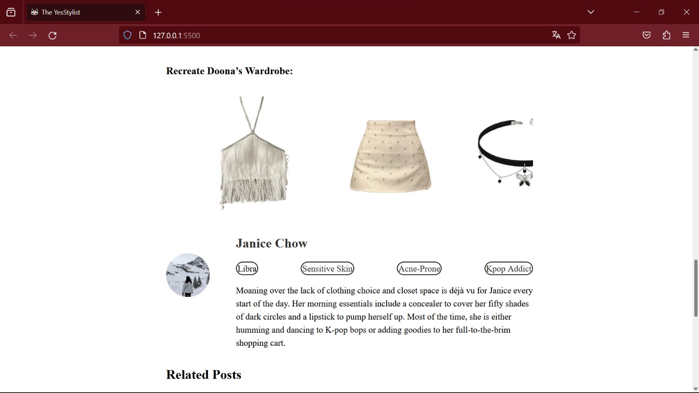
  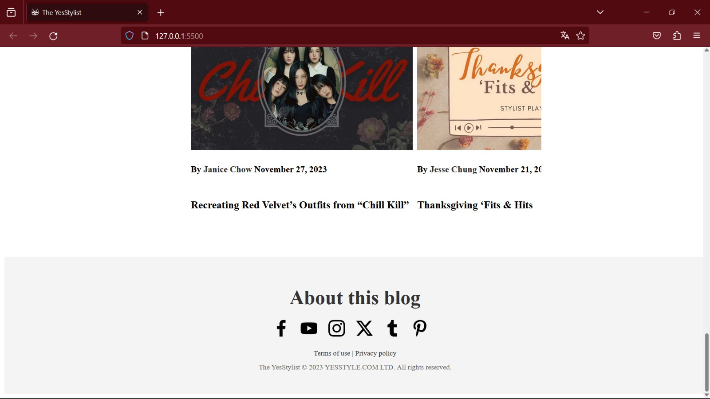
  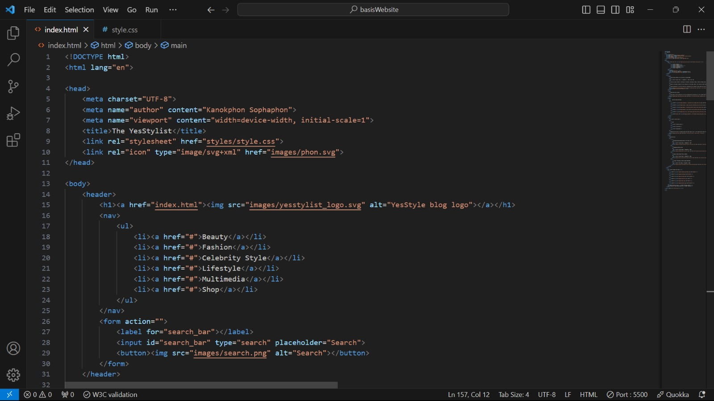
  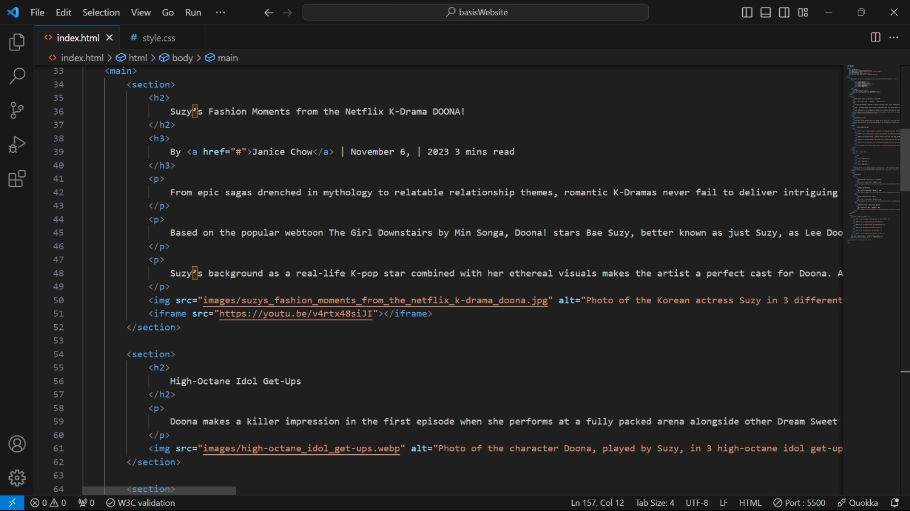
  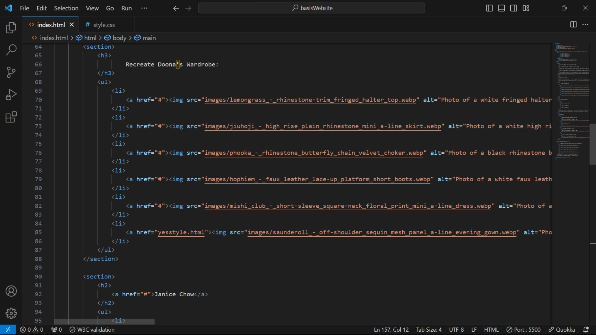
  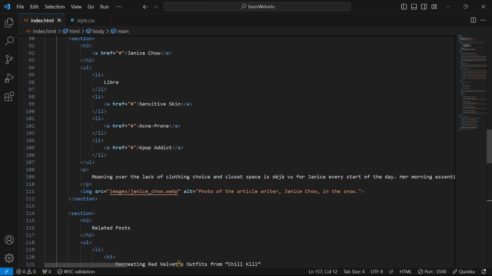
  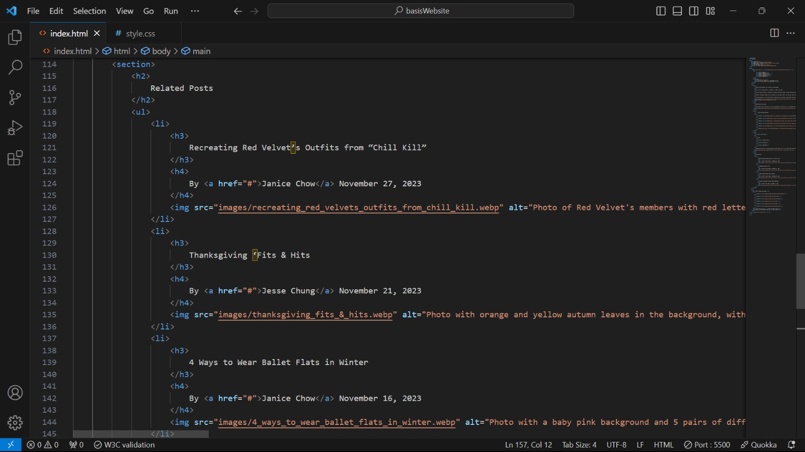
  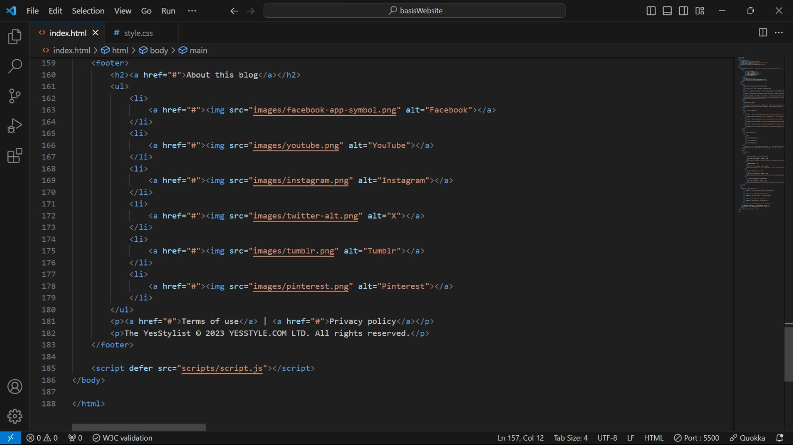

  ### Agenda voor meeting
  samen met je groepje opstellen

  | Zoë       | Mees           | Kanokphon     | Silke         |
  | ---            | ---                | ---          | ---              |
  | button center  | links positioneren  | dezelfde root in 3 css    | ?    |
  | verticale schuifbare | gif dowloaden | sneller responsive coderen | ? |
  | YouTube filmpje      | ...                | ...          | ...              |

  ### Verslag van meeting
  hier na afloop snel de uitkomsten van de meeting vastleggen

  - punt 1
  - punt 2
  - nog een punt
- ...

## Toegankelijkheidstest 2/2 (week 4)

  
uitwerken na test in 9e werkgroep

  ### Bevindingen
  Lijst met je bevindingen die in de test naar voren kwamen (geef ook aan wat er verbeterd is):

## Voortgang 3 (week 4)

  
uitwerken voor 3e voortgang

  ### Stand van zaken
  hier dit ging goed & dit was lastig (neem ook screenshots op van delen van je website en code)

  ### Agenda voor meeting
  samen met je groepje opstellen

  | student 1      | student 2          | student 3    | student 4        |
  | ---            | ---                | ---          | ---              |
  | dit bespreken  | en dit             | en ik dit    | en dan ik dat    |
  | en dat ook nog | dit als er tijd is | nog een punt | dit wil ik zeker |
  | ...            | ...                | ...          | ...              |

  ### Verslag van meeting
  hier na afloop snel de uitkomsten van de meeting vastleggen

  - punt 1
  - punt 2
  - nog een punt
  - ...

## Eindgesprek (week 5)

  
uitwerken voor eindgesprek

  ### Je uitkomst - karakteristiek screenshots:
  

  ### Dit ging goed/Heb ik geleerd: 
  Korte omschrijving met plaatjes

  

  ### Dit was lastig/Is niet gelukt:
  Korte omschrijving met plaatjes

  

## Bronnenlijst

  
continu bijhouden terwijl je werkt

  Nb. Wees specifiek ('css-tricks' als bron is bijv. niet specifiek genoeg). 
  Nb. ChatGpT en andere AI horen er ook bij.
  Nb. Vermeld de bronnen ook in je code.

  1. bron 1
  2. bron 2
  3. ...

